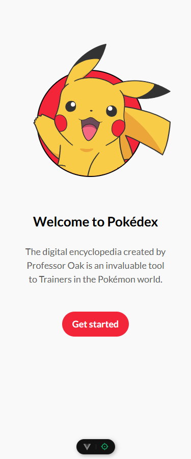
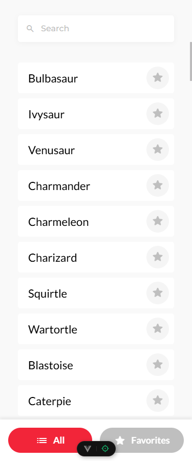
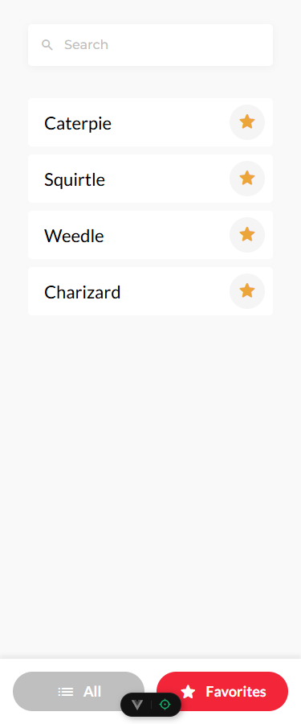
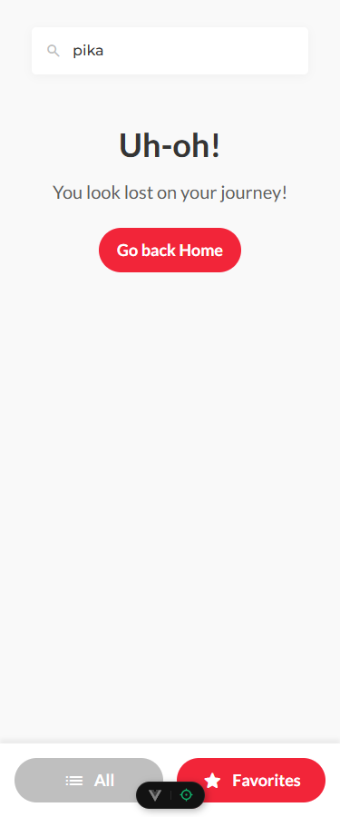
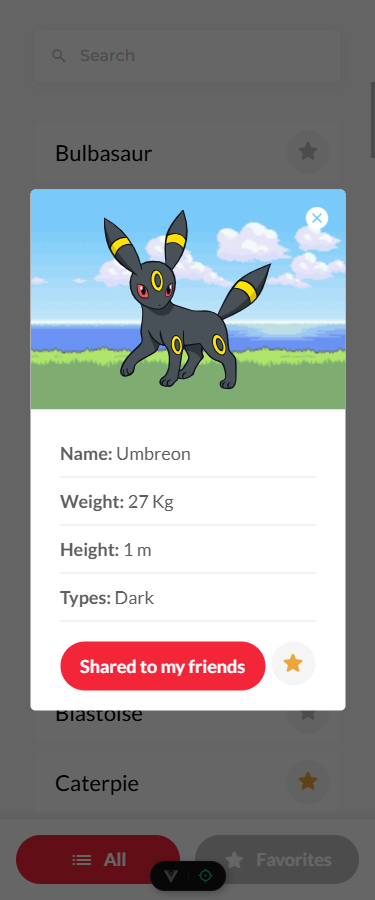
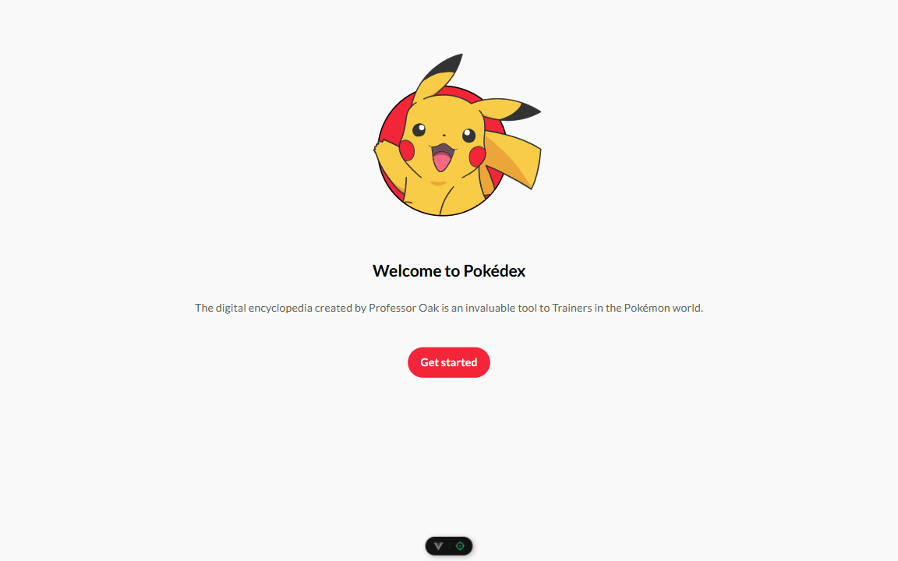
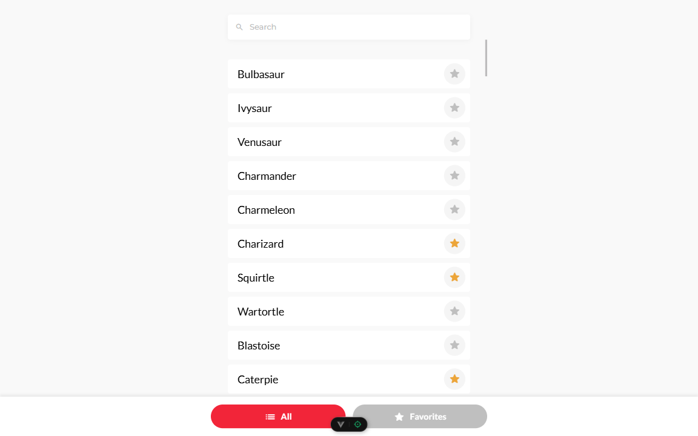
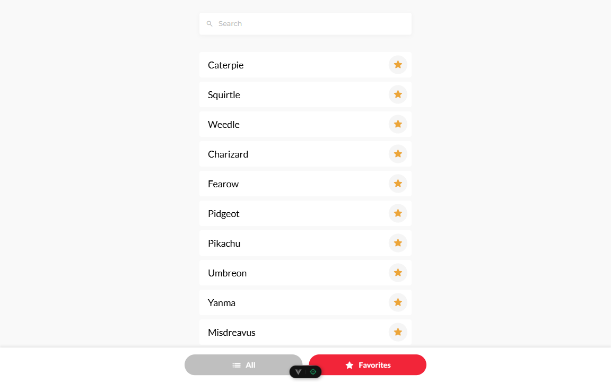
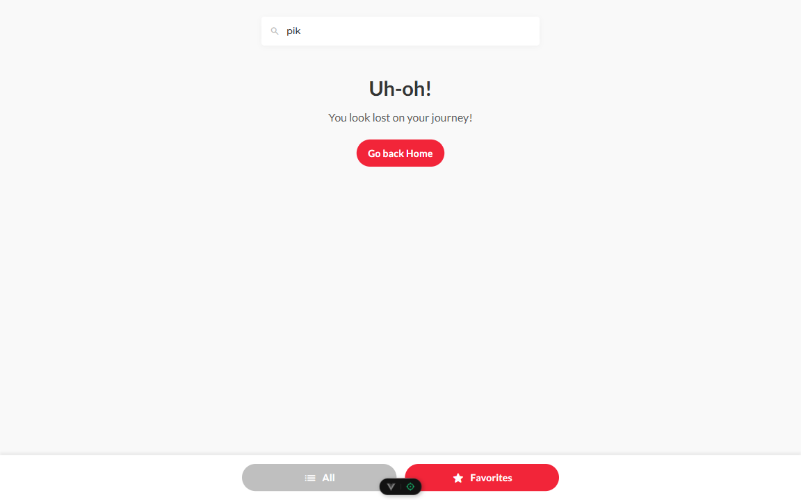
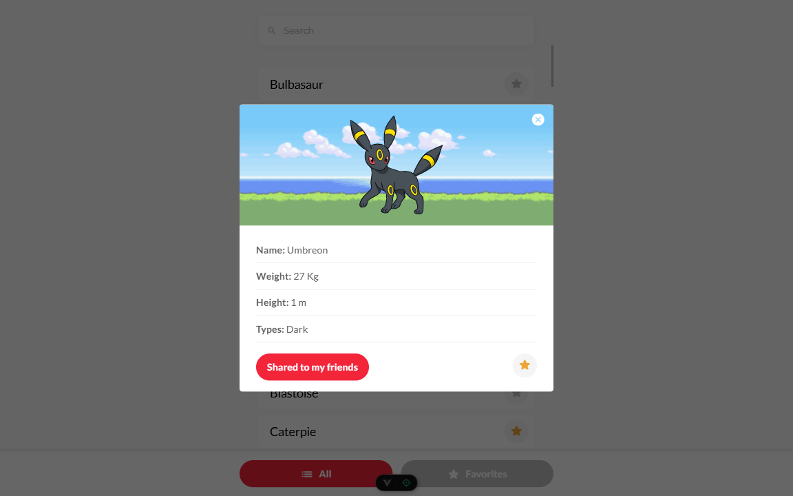

# PokeVue

Página creada para probar mis conocimientos acerca de Vue3, implementando storages, routes, componentización y buenas prácticas. Con información obtenida directamente de la [PokeAPI](https://pokeapi.co/).

**Demo en vivo:** [PokeVue](https://jonathang92.github.io/pokevue/)

## Tecnologías usadas y Decisiones tomadas para el desarrollo

### Vue como framework principal

Esta aplicación está construida con **Vue.js** en su versión 3, utilizando **Composition API**.

### Estilos CSS

A pesar de tener experiencia con frameworks de CSS como Tailwind CSS o Bootstrap, para este proyecto decidí utilizar **CSS simple y puro**. Esto me permitió un mayor control sobre los estilos y evité la carga de dependencias innecesarias, manteniendo el proyecto simple.

### Pinia para gestión de los favoritos y el loader global

Para la gestión de la lista de pokemons favoritos, escogí **Pinia**, usando la sintaxis de "Setup Stores" de Pinia, que es muy parecida a Composition API de Vue.

### Persistencia de pokemons favoritos: Pinia Plugin Persistedstate

Para asegurarme de que la lista de pokemons favoritos se mantenga después de cerrar o recargar la página, integré el plugin `pinia-plugin-persistedstate`, me pareció una forma más elegante de persistir los datos (en este caso, en `localStorage`).

### Rutas con Vue Router

Implementé **Vue Router** desde la instalación. Una de las cosas interesantes de usarlo aparte de tener rutas predefinidas fue para que cada pokemon tuviera su **propia ruta dedicada** y así permitirme compartir un enlace directo al detalle de un pokemon específico ya que al acceder a la ruta debería abrir directamente el modal con el detalle de este.

### Funcionalidad de Compartir el pokemon

Para la funcionalidad de "Compartir", mi primera opción fue usar la **Web Share API** ya que ofrece una experiencia de usuario más elegante permitiendo compartir la url en las distintas aplicaciones instaladas en el dispositivo del usuario (redes sociales, mensajes...) pero si la Web Share API no está disponible, la aplicación **copia la URL completa de la página actual al portapapeles**. asegurando que siempre haya una forma de compartir el enlace en navegadores que no soporten la Web Share API.

### Implementación de Scroll Infinito

Ya que manejar el listado de pokemons implica una gran cantidad de datos implementé una lógica de **scroll infinito** para que a medida de que se desplace el contenido hasta el final se cargue automáticamente más pokemons a la misma, logrando un buen rendimiento y una buena experiencia de usuario al no tener que cargar todos los datos de golpe.

### Buscador (para la lista de pokemons existente y favoritos)

A pesar de que el diseño contempla un buscador y que la PokeAPI no tiene un endpoint para buscar pokemons por nombre, decidí implementar un buscador para que filtre la lista de pokemons y los favoritos del usuario y así no quede como un simple elemento visual.

## Características de la aplicación

- Vista de Home o Welcome.
- Visualización de una lista de pokemons.
- Scroll infinito para cargar más pokemons.
- Modal con detalles específicos de cada pokemon (peso, altura, tipos, imagen).
- Sistema para marcar y desmarcar pokemons como favoritos.
- Buscador en la lista de pokemons y favoritos.
- Persistencia de la lista de favoritos.
- Funcionalidad para compartir los detalles de pokemon (con Web Share API o copiando enlace).
- Rutas dedicadas para cada detalle de pokemon.

## Capturas de Pantalla

### Mobile

### Desktop

